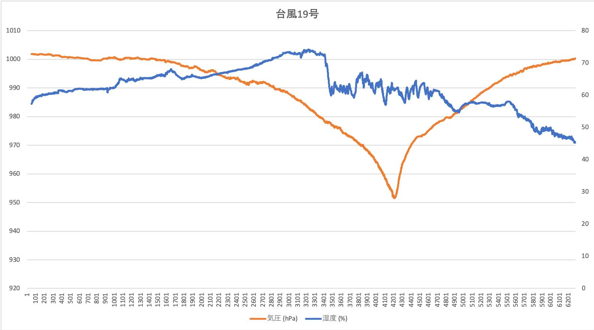

# BME280を使用したデータ記録

このコードは、Seeed Wio 3GとBME280を使用して、温度、湿度、気圧をSDカードに記録します。

## 使用機材

* [Seeed Wio 3G](https://os.mbed.com/platforms/Seeed-Wio-3G/)
* [BME280モジュール](https://www.switch-science.com/catalog/2236/)
* [Seeed Grove LED Button](https://www.switch-science.com/catalog/5350/)

## 使用方法

BME280は、Grove I2C コネクタに接続します。接続方法は、[こちら](https://os.mbed.com/components/BME280-Combined-humidity-and-pressure-se/)を参照してください。  
LED Button は、Grove D20 コネクタに接続します。  

電源を投入するとネットワークに接続し、NTPサーバから現在時刻を取得します。30秒毎にセンサーから気温、湿度、気圧情報を取得し、SDカードの record.csv ファイルに書き込み（追加書き込み）します。 30秒毎にボタンLEDは点滅します。 
データ取得周期を変更したい場合は、ソースコード中の `MEASURE_PERIOD` を変更してください。

測定を終了するときは、LEDボタンを押してください（安全にファイルをクローズします）。LEDが高速に点滅したら、電源をオフしてください。

## データの利用方法

SDカードの書き込まれたファイルは、CSV形式で保存されているので、エクセルなどでグラフとして表示することが出来ます。

